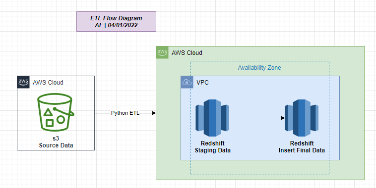
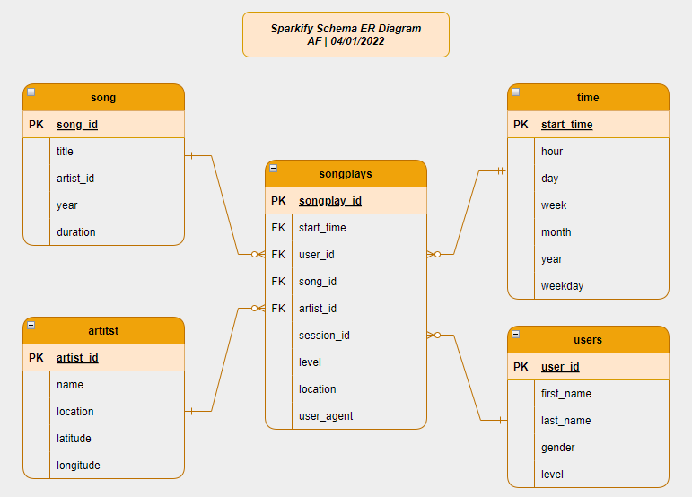

### Udacity Data Engineering Nanodegree
# Data Warehouse in AWS Redshift


## Introduction
A music streaming startup, Sparkify, has grown their user base and song database and want to move their processes and data onto the cloud. Their data resides in S3, in a directory of JSON logs on user activity on the app, as well as a directory with JSON metadata on the songs in their app.

As their data engineer, you are tasked with building an ETL pipeline that extracts their data from S3, stages them in Redshift, and transforms data into a set of dimensional tables for their analytics team to continue finding insights into what songs their users are listening to. You'll be able to test your database and ETL pipeline by running queries given to you by the analytics team from Sparkify and compare your results with their expected results.

## Project Description
In this project, you'll apply what you've learned on data warehouses and AWS to build an ETL pipeline for a database hosted on Redshift. To complete the project, you will need to load data from S3 to staging tables on Redshift and execute SQL statements that create the analytics tables from these staging tables.


### Project Datasets
For this project, you'll be working with two datasets that reside in S3. Here are the S3 links for each:

- Song data: `s3://udacity-dend/song_data`
- Log data: `s3://udacity-dend/log_data`
- Log data json path: `s3://udacity-dend/log_json_path.json`

#### Song Dataset
The first dataset is a subset of real data from the [Million Song Dataset](https://labrosa.ee.columbia.edu/millionsong/). Each file is in JSON format and contains metadata about a song and the artist of that song. The files are partitioned by the first three letters of each song's track ID. For example, here are filepaths to two files in this dataset.

`song_data/A/B/C/TRABCEI128F424C983.json`
`song_data/A/A/B/TRAABJL12903CDCF1A.json`

And below is an example of what a single song file, `TRAABJL12903CDCF1A.json`, looks like.

```
{"num_songs": 1, "artist_id": "ARJIE2Y1187B994AB7", "artist_latitude": null, "artist_longitude": null, "artist_location": "", "artist_name": "Line Renaud", "song_id": "SOUPIRU12A6D4FA1E1", "title": "Der Kleine Dompfaff", "duration": 152.92036, "year": 0}
```

#### Log Dataset
The second dataset consists of log files in JSON format generated by this [event simulator](https://github.com/Interana/eventsim) based on the songs in the dataset above. These simulate app activity logs from an imaginary music streaming app based on configuration settings.

The log files in the dataset you'll be working with are partitioned by year and month. For example, here are filepaths to two files in this dataset.

`log_data/2018/11/2018-11-12-events.json`
`log_data/2018/11/2018-11-13-events.json`

Below is an example of what the data in a log file, `2018-11-12-events.json`, looks like.


## Goals
In this project, we apply what we've learned on data warehouses and AWS to build an ETL pipeline for a database hosted on Redshift.

To complete the project, we need to:
1. Load data from S3 to staging tables in Redshift
2. Execute SQL statements that create the dimensions and fact tables from these staging tables and then inserts data from the staging area into the final detination tables.

### Implementation Steps

#### AWS ETL Flow Diagram


#### Create Table Schemas
1. Design schemas for your fact and dimension tables
1. Write a SQL CREATE statement for each of these tables in sql_queries.py
1. Complete the logic in create_tables.py to connect to the database and create these tables
1. Write SQL DROP statements to drop tables in the beginning of create_tables.py if the tables already exist. This way, you can run create_tables.py whenever you want to reset your database and test your ETL pipeline.
1. Launch a redshift cluster and create an IAM role that has read access to S3.
1. Add redshift database and IAM role info to dwh.cfg.
1. Test by running create_tables.py and checking the table schemas in your redshift database. You can use Query Editor in the AWS Redshift console for this.

#### Build ETL Pipeline
1. Implement the logic in etl.py to load data from S3 to staging tables on Redshift.
1. Implement the logic in etl.py to load data from staging tables to analytics tables on Redshift.
1. Test by running etl.py after running create_tables.py and running the analytic queries on your Redshift database to compare your results with the expected results.
1. Delete your redshift cluster when finished.

### Running the Project
Here are the steps to run the project:

1. Add your AWS keys to `dwh.cfg` in the project root folder.

1. Create a data warehouse cluster in AWS Redshift:
`python create_cluster.py` The new cluster endpoint and ARN are automatically saved to `dwh.cfg`.

1. Create the Postgres tables:
`python create_tables.py`

1. Extract data from source files and load it into the datawarehouse tables:
`python etl.py`

1. Run test queries and create visualizations for data analysis (done via the notebook [`analytics.ipynb`](analytics.ipynb)).

1. Delete the cluster: `python delete_cluster.py`


#### Schema Diagram


### Example Analytics
Please check this notebook for sample analytics [`analytics.ipynb`](analytics.ipynb)

